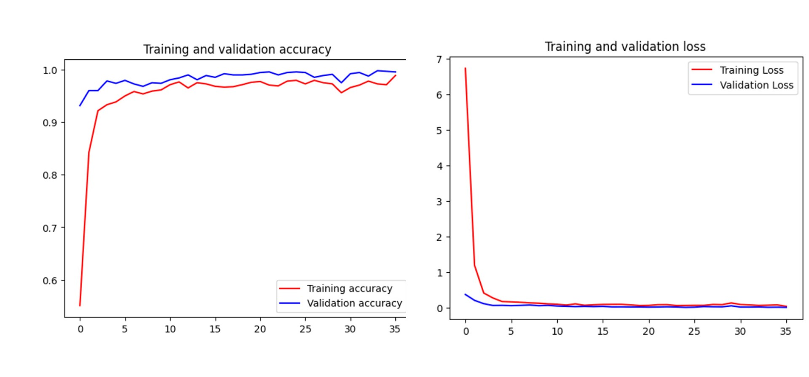

# gamsit
A rock-paper-scissor game that uses object detection image processing using transfer learning inception V3

<h1 align="center">Rock ✊🏼 Paper ✋🏼 Scissors ✌🏼</h1>

<p align="center">
    In this project, I explore how we can use CNN and transfer learning to build an image classifier. <br>The dataset consists of 2188 images that classified by <strong>Rock<strong>, <strong>Paper<strong>, and <strong>Scissors<strong>.
</p>

<p align="center">
   The full dataset can be downloaded <a href="https://github.com/dicodingacademy/assets/releases/download/release/rockpaperscissors.zip">here</a>
</p>

## File Structure

```

├── models
│   ├── model_rock_paper_scissor_.ipynb
│   └── model.h5
├── static
│   ├── uploud files
├── app.py
├── labels.txt
├── requirements.txt
├── Dockerfile
└── etc.
```

<p align="center">
   Because the model size is too large, can be downloaded <a href="https://github.com/dicodingacademy/assets/releases/download/release/rockpaperscissors.zip">here</a>
</p>
   
- then move it to the directory ```/models```


## File Description

There are only 3 important files in this repository.
- `model_rock_paper_scissor_.ipynb` is a jupyter notebook which can be run on Google Colab (with GPU for faster training). It contains step-by-step on how to create the image classifier and export the model. 
- `model.h5` is the trained weights of our deep learning model's layers. This is used to load the model in our web app.
- `app.py` is the python file to deploy our web app in Streamlit.


## How to Use

To run the project locally, you can download this repo and type 

or

```
git clone https://github.com/azissukmawan/gamsit.git
```

```
cd gamsit
```

```
streamlit run app.py
```

To view the project as a deployed online web app hosted by Heroku, you can check out with [this link](https://gamsit-b06bba895a32.herokuapp.com/)

<video src="demo_gamsit.mp4" controls title="Title"></video>


## Model Description

The foundational model that we use is Inception-V3 from Keras' pretrained models. However, we cut it off until 'mixed7' layer, and then add our own layers.

Read more about this model at:
- https://keras.io/api/applications/inceptionv3/
- https://arxiv.org/abs/1512.00567


## Model Evaluation

We achieved 98% accuracy on training set and 99% accuracy on validation set.

<details>
<summary>Confussion Matrix</summary>

<br>

```
[[711   0   1]
 [  5 721   0]
 [  2   0 748]]
```

</details>

<details>
<summary>Classification Report</summary>

<br>

```
              precision    recall  f1-score   support

        Rock       0.99      1.00      0.99       712
       Paper       1.00      0.99      1.00       726
    Scissors       1.00      1.00      1.00       750

    accuracy                           1.00      2188
   macro avg       1.00      1.00      1.00      2188
weighted avg       1.00      1.00      1.00      2188
```

<summary>Training and Validation Accuracy and Loss</summary>

<br>


